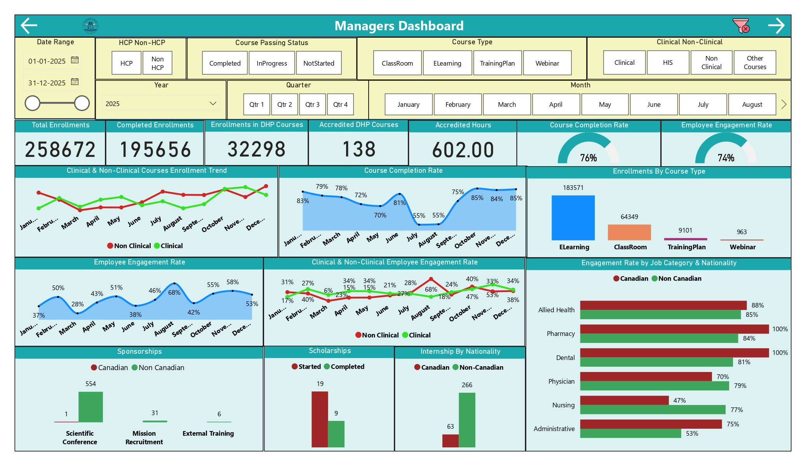
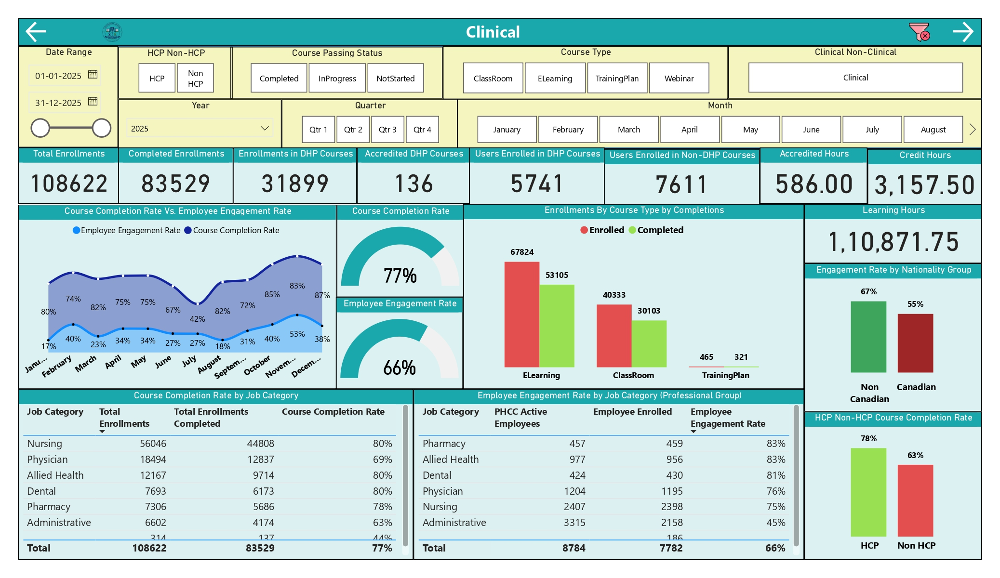
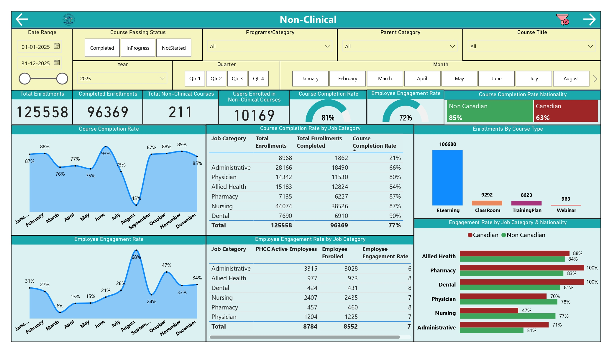
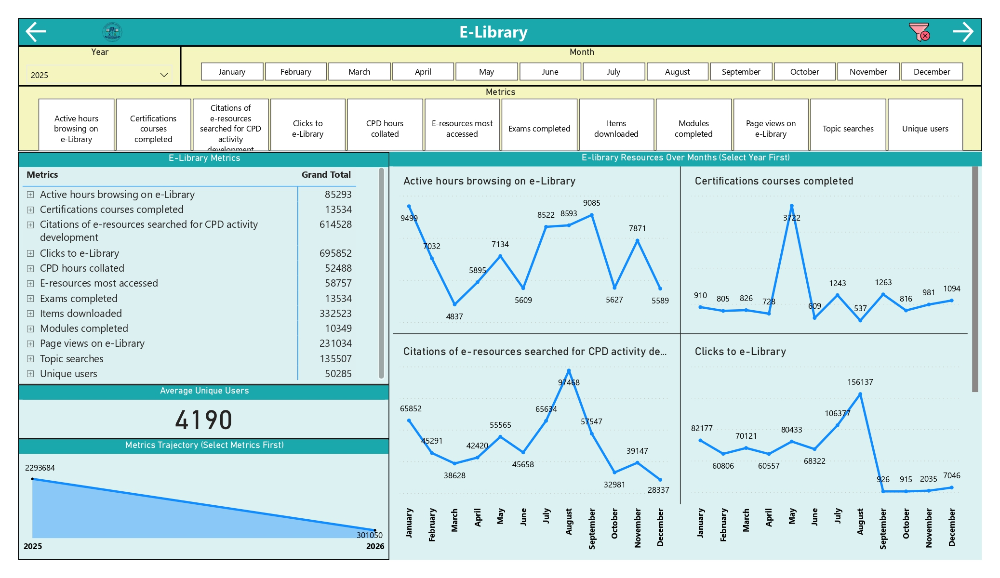
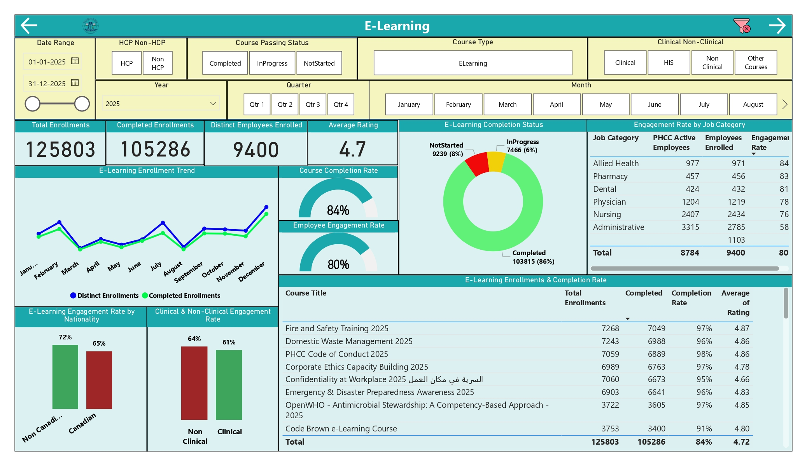
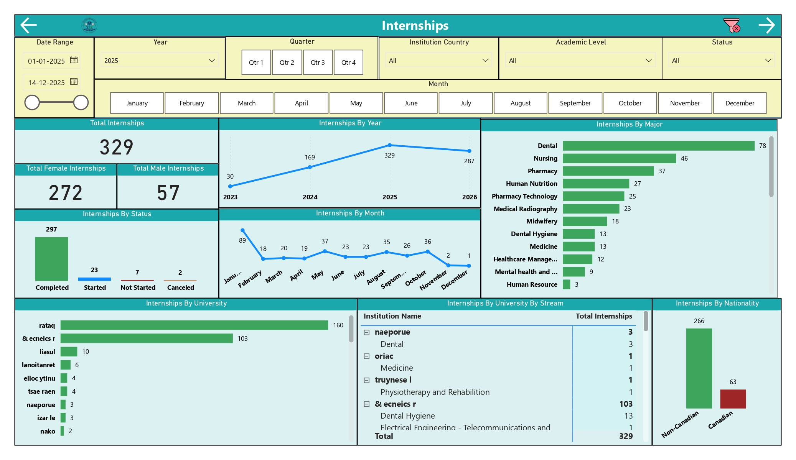
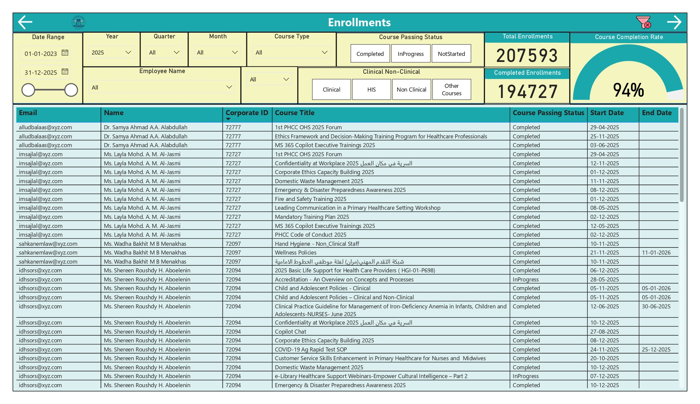
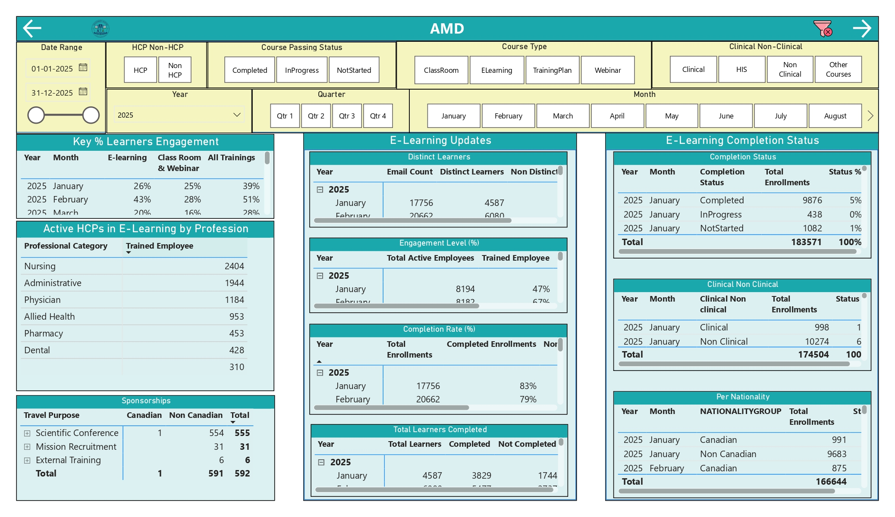
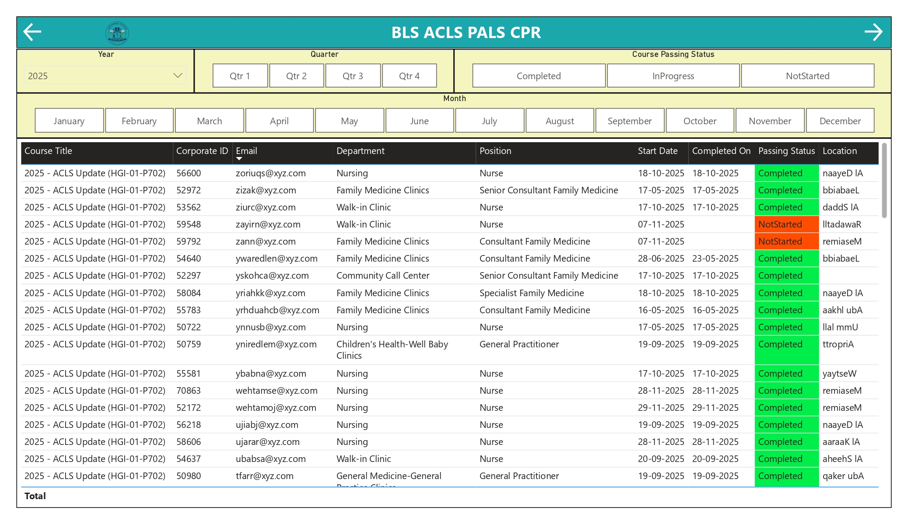
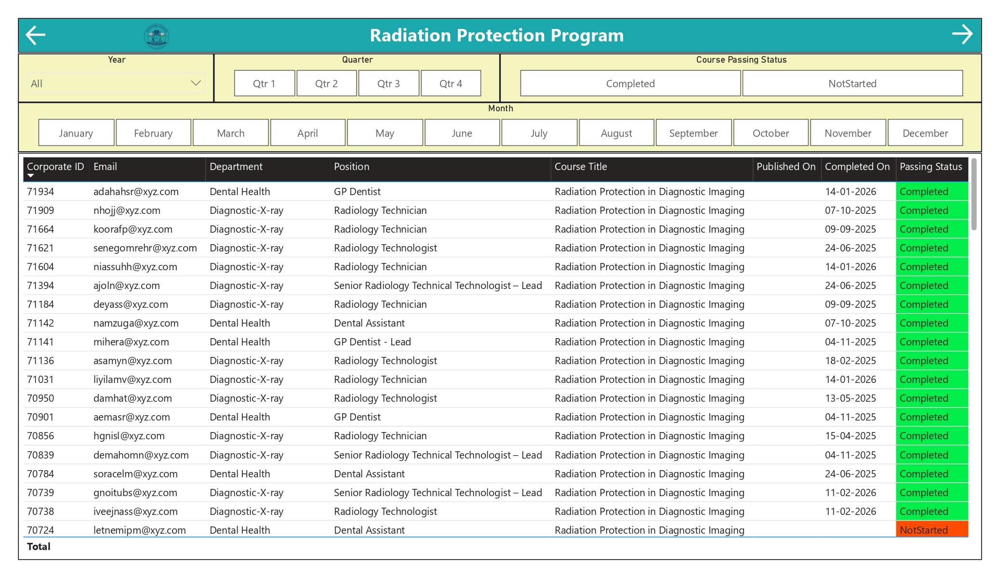

# Data-Driven-Excellence-Centralizing-Training-Intelligence-for-National-Healthcare-Compliance
Developed a centralized SSIS Data Warehouse to integrate LMS 365, Oracle ERP, and departmental data. This resolved OData volume constraints and enabled YoY trend analysis. The resulting Power BI dashboard delivered 30% more insights, tracking 258k+ enrollments and a 74% employee engagement rate across the corporation.

---

## 🔗 View Live Demo

👉 **[View Power BI Dashboard](https://app.powerbi.com/)**

---

**Introduction**

This project involved a comprehensive overhaul of the data infrastructure for the **Workforce Training Department** of a major government hospital corporation. Tasked with managing the training lifecycle for both healthcare professionals (Physicians, Nurses, Technicians) and non-healthcare staff (IT, HR, Safety), the department required a system capable of tracking mandatory and non-mandatory training across diverse platforms. The project successfully transitioned the organization from a fragmented legacy reporting model to a centralized, automated **Data Warehouse** environment, delivering a **30% increase in actionable insights**.

---

**Problem Statement**

The legacy data environment relied on direct **OData** fetches from LMS 365 and manual exports from **Oracle ERP** and departmental folders. This created several critical bottlenecks:

- **Data Volume Constraints:** OData fetches were too large for standard tools like Power BI to process efficiently, limiting analysis to a single year at a time.
- **Performance Latency:** Connecting to multiple live sources simultaneously caused extreme slowdowns in analytical software.
- **Lack of Trend Visibility:** Due to the inability to load historical data alongside current data, year-over-year (YoY) comparative analysis was impossible without manually cross-referencing separate files.
- **Siloed Reporting:** Sub-departmental data (Academic Affairs, E-Learning, Clinical/Non-Clinical) existed in isolation, preventing a unified corporate view.

---

**Solution Overview**

The solution centered on moving away from "live-fetching" raw data to an **Extract, Transform, Load (ETL)** architecture.

**Pre-Project Step: Data Governance Framework**

To ensure the integrity of the new warehouse, a **Data Governance Framework** was established before technical development. This involved:

- **Standardizing Definitions**: Defining "Employee Engagement" consistently across all hospitals.
- **Data Ownership**: Assigning accountability for data quality within sub-departments (e.g., Clinical vs. E-Learning).
- **Security Protocols**: Ensuring PII (Personally Identifiable Information) from Oracle ERP was handled according to government healthcare privacy standards.

**Data Warehousing with SSIS**

Using **SQL Server Integration Services (SSIS)**, a robust data pipeline was engineered to automate the flow of information:

- **Staging Layer:** Raw data from LMS OData, Oracle ERP, and Shared Folders was extracted and loaded into a staging area in **SSMS** to minimize impact on source systems.
- **Transformation:** Data was cleansed, deduplicated, and standardized. For example, employee records from Oracle were mapped to training enrollments in the LMS.
- **Loading:** The processed data was loaded into a Production Data Warehouse.

**Data Modeling (Star Schema)**

To optimize for Power BI performance, a **Star Schema** was implemented:

- **Fact Table:** A central table containing transactional data, such as **Total Enrollments** (258,672) and **Completed Enrollments** (195,656).
- **Dimension Tables:** Surrounding the fact table are descriptive attributes including **Employee Details** (Job Category, Nationality), **Date Hierarchy** (Year, Quarter, Month), **Course Details** (Type: ELearning, Classroom, Webinar), and **Departmental Metrics**.

---

**Visualization: Power BI Dashboard Suite**

The final dashboard provides a multi-layered view of corporate training health.

- **Page 1: Navigation Hub:** A user-friendly entry point allowing stakeholders to jump to specific sub-departmental views (Clinical, E-Library, Internships).
- **Page 2: Managers Dashboard:** \* **Audience:** Executive Leadership and Department Heads.
  - **Purpose:** High-level KPIs including a **76% Course Completion Rate** and **74% Employee Engagement Rate**. It tracks trends such as the peak in enrollments for Clinical courses during Q4.
- **Page 3: Clinical Deep Dive:**
  - **Audience:** Chief Medical Officers and Clinical Educators.
  - **Purpose:** Monitors specialty-specific performance, highlighting that **Nursing** leads in volume (56,046 enrollments) while **Dental** and **Allied Health** maintain 80% completion rates.
- **Page 4: Non-Clinical Performance:**
  - **Audience:** Administrative Directors and Operations Managers.
  - **Purpose:** Focuses on mandatory safety and IT training, showing a high completion rate for **Pharmacy** (87%) and **Nursing** (87%) in non-clinical contexts.
- **Page 5: E-Library Metrics:**
  - **Audience:** Academic Affairs and Research Staff.
  - **Purpose:** Tracks engagement with digital resources, reporting **695,852 total clicks** and **85,293 active browsing hours**.
- **Page 6: E-Learning & Course Titles:**
  - **Audience:** Course Developers (E-Learning Team).
  - **Purpose:** Evaluates specific course quality, such as **Fire and Safety Training 2025** (97% completion, 4.87/5 rating).
- **Page 7: Academic Affairs (Internships/Scholarships):**
  - **Audience:** HR and Academic Partners.
  - **Purpose:** Tracks the pipeline of new talent, showing **329 total internships** with a heavy focus on **Dental** and **Nursing** majors.

**Overall Dashboard Purpose:** To provide a single source of truth that balances corporate-wide KPIs with the ability to drill down into individual employee compliance and course-level feedback.

---

**End-to-End Architecture**

**Tech Stack:** SSIS (ETL), SSMS (Data Warehouse), SQL (Transformation), Power BI (Visualization), Python (Advanced Analytics), Excel (Legacy Source Support).

**Data Flow:**

- **Sources:** LMS 365 (OData), Oracle ERP (SQL), Shared Folders (Excel/CSV).
- **Orchestration (SSIS):** Automated extraction and incremental loading.
- **Storage (SQL Server):** Centralized Data Warehouse using a Star Schema.
- **Feature Engineering (SQL/Python):** Creation of complex measures like **Engagement Rate** (Employees Enrolled vs. Active Employees).
- **Analytics Layer:** Power BI Desktop for modeling and Power BI Service for sharing.

---

**Results / ROI**

- **Eliminated Data Latency:** Multi-year data now loads in seconds rather than minutes, or failing entirely.
- **Comprehensive Trend Analysis:** For the first time, the corporation can see seasonal trends, such as the drop in **Employee Engagement** to **18% in August**.
- **Enhanced Compliance:** Real-time tracking of mandatory training for **7,782 trained employees** across the corporation.
- **Data-Driven Partnerships:** Academic Affairs can now prove the value of their **MoUs** through clear internship-to-employment metrics.
- **High Quality Standards:** Achieved an average E-Learning rating of **4.7/5** across over 100,000 completed enrollments.

---

**Tech Stack: The Data Engineering & Analytics Infrastructure**

To deliver this mega project, a robust and integrated technology stack was utilized to handle everything from heavy data lifting to high-end visualization. Each component was selected to solve the specific bottlenecks found in the legacy system.

**Data Integration & ETL (The Engine)**

- **SQL Server Integration Services (SSIS)**: Acted as the primary ETL orchestrator, automating the extraction of massive LMS data via OData and merging it with Oracle ERP records.
- **Incremental Loading Logic**: Configured within SSIS to ensure only new or updated records were fetched, solving the previous system's inability to load data beyond a single year.

**Data Warehousing & Storage (The Foundation)**

- **SQL Server Management Studio (SSMS)**: Served as the central environment for developing and managing the Data Warehouse.
- **Transact-SQL (T-SQL)**: Used for deep-level data cleaning, creating stored procedures, and structuring the **Star Schema** (Fact and Dimension tables) to optimize query performance.
- **Oracle ERP Database**: The source system for core employee information, which was seamlessly integrated into the central warehouse.

**Advanced Analytics & Engineering (The Intelligence)**

- **Python**: Utilized for feature engineering and advanced data processing that exceeded standard SQL capabilities, specifically for complex statistical analysis across multi-year datasets.
- **DAX (Data Analysis Expressions)**: Leveraged within Power BI to create custom measures such as the **Employee Engagement Rate** (74%) and **Course Completion Rate** (76%).

**Visualization & Reporting (The Interface)**

- **Power BI Desktop & Service**: The primary tool for building the interactive dashboard suite, providing 30% more insights than the legacy reporting method.
- **LMS 365 (OData)**: The source for all digital learning metrics, now efficiently processed through the middleware layer to avoid performance lag.

**Support & Documentation**

- **Microsoft Excel**: Used as a secondary data source for sub-departmental shared folders and for initial data validation during the "Data Governance" phase.
